# Address/Selection UX Audit — Evidence Notes
**Timestamp:** 2025-10-20 12:05:00

---

## Current Controls (index.html)

```html
<input id="addrA" type="text" placeholder="Enter address (placeholder)" />
<button id="useCenterBtn">Select on map</button>

<select id="radiusSel">
  <option value="400">400 m</option>
  <option value="800">800 m</option>
</select>

<select id="adminSel">
  <option value="districts" selected>Districts</option>
  <option value="tracts">Tracts</option>
</select>
```

---

## State Keys Related to Area Selection

| Key | Type | Default | Purpose |
|-----|------|---------|---------|
| `addressA` | `string \| null` | `null` | Text input (NOT FUNCTIONAL) |
| `selectMode` | `string` | `'idle'` | `'idle'` \| `'point'` (for crosshair mode) |
| `centerLonLat` | `[number,number] \| null` | `null` | WGS84 coords of picked point |
| `center3857` | `[number,number] \| null` | `null` | EPSG:3857 coords (for SQL queries) |
| `radius` | `number` | `400` | Buffer radius in meters |
| `adminLevel` | `string` | `'districts'` | `'districts'` \| `'tracts'` |

---

## Event Flow

### A. "Select on map" Button Click ([panel.js:42-54](../src/ui/panel.js#L42-L54))

1. User clicks button
2. `store.selectMode` → `'point'`
3. Button text changes to "Cancel"
4. Cursor changes to crosshair
5. Hint text appears: "Click the map to set A (center). Press Esc to cancel."

### B. Map Click While in Point Mode ([main.js:127-147](../src/main.js#L127-L147))

1. User clicks map
2. `if (store.selectMode === 'point')` → true
3. Extract `lngLat` from event
4. Set `store.centerLonLat = [lng, lat]`
5. Call `store.setCenterFromLngLat(lng, lat)` → sets `center3857`
6. Place red marker at clicked location
7. Call `upsertBufferA(map, { centerLonLat, radiusM })` → draws circle
8. Reset `selectMode` to `'idle'`
9. Call `refreshAll()` → updates charts/maps

### C. Admin Level Change ([panel.js:90-93](../src/ui/panel.js#L90-L93))

1. User changes dropdown
2. `store.adminLevel` → `'districts'` or `'tracts'`
3. Debounced `onChange()` → `refreshAll()`
4. [main.js:70-78](../src/main.js#L70-L78): If `'tracts'`, call `getTractsMerged` and `renderTractsChoropleth`; else call `getDistrictsMerged` and `renderDistrictChoropleth`

### D. Radius Change ([panel.js:56-62](../src/ui/panel.js#L56-L62))

1. User changes dropdown (400m vs 800m)
2. `store.radius` → new value
3. Optional `handlers.onRadiusInput` called (NOT DEFINED in current code)
4. Debounced `onChange()` → `refreshAll()`
5. **Problem:** Buffer circle does NOT update (no call to `upsertBufferA`)

---

## Pain Points Identified

### 🔴 P0: Radius Control Shown When Irrelevant

**Issue:** When `adminLevel` is `'districts'` or `'tracts'`, the radius control is still visible and functional, but has NO EFFECT on choropleth rendering (only affects buffer-based charts).

**Evidence:**
- [main.js:70-78](../src/main.js#L70-L78): Districts/tracts rendering does NOT use `radiusM`
- Only charts ([charts/index.js:36-38](../src/charts/index.js#L36-L38)) use `radiusM` for buffer queries

**Confusion:** User changes radius expecting choropleth to update, but nothing happens (because choropleth is area-based, not buffer-based).

---

### 🔴 P0: Ambiguity Between "Buffer Mode" and "Area Mode"

**Issue:** No explicit distinction between:
- **Point Buffer Mode:** User picks a point + radius → shows incidents within circle
- **Area Selection Mode:** User picks a district/tract polygon → shows all incidents in that boundary

**Current behavior:** Both modes coexist awkwardly:
- Districts choropleth always renders (all districts shown)
- Buffer circle appears when user clicks map
- Radius affects charts but not choropleth
- No way to "select just one district" and hide others

---

### 🟠 P1: Buffer Circle Doesn't Update on Radius Change

**Issue:** User changes radius from 400m → 800m, but buffer circle stays at 400m (visual mismatch).

**Root cause:** [panel.js:58](../src/ui/panel.js#L58) defines `handlers.onRadiusInput`, but [main.js:111](../src/main.js#L111) doesn't pass this handler.

**Expected:** Circle should redraw when radius changes.

---

### 🟠 P1: Address Input Non-Functional

**Issue:** Text input exists but has no geocoding integration.

**Evidence:**
- [panel.js:37-40](../src/ui/panel.js#L37-L40): Listens to `input` event and sets `store.addressA`, but nothing consumes this value
- No geocoding API calls (Mapbox, Google, Nominatim, etc.)

---

### 🟡 P2: District Click Shows Popup But Doesn't Set Selection

**Issue:** Clicking a district polygon ([ui_popup_district.js:8](../src/ui/popup_district.js#L8)) shows a popup with stats, but doesn't:
- Highlight/select that district as the "active area"
- Filter points/charts to that district only
- Hide other districts

**Current behavior:** Popup is informational only; no interactivity.

---

### 🟡 P2: No Visual Feedback for "Active Area"

**Issue:** When user is in "tracts" mode, there's no indication of which tract they're analyzing (no selection state, no highlighting).

---

### 🟡 P2: Esc Key to Cancel Not Implemented

**Issue:** Hint text says "Press Esc to cancel," but [main.js](../src/main.js) has no Esc key listener.

---

## Code Map: Key Locations

### (a) Address Input Handling
- **Markup:** [index.html:34](../index.html#L34) `<input id="addrA" />`
- **Event listener:** [panel.js:37-40](../src/ui/panel.js#L37-L40)
- **State mutation:** [panel.js:38](../src/ui/panel.js#L38) `store.addressA = addrA.value`
- **Consumer:** NONE (dead code)

### (b) "Select on Map" Toggle
- **Markup:** [index.html:35](../index.html#L35) `<button id="useCenterBtn">`
- **Event listener:** [panel.js:42-54](../src/ui/panel.js#L42-L54)
- **State mutation:** [panel.js:44, 49](../src/ui/panel.js#L44) `store.selectMode = 'point'` / `'idle'`
- **Map click handler:** [main.js:127-147](../src/main.js#L127-L147)
- **Marker placement:** [main.js:133-138](../src/main.js#L133-L138)
- **Buffer drawing:** [main.js:139](../src/main.js#L139) → [buffer_overlay.js:3-14](../src/map/buffer_overlay.js#L3-L14)

### (c) Admin Level Switch
- **Markup:** [index.html:60-63](../index.html#L60-L63) `<select id="adminSel">`
- **Event listener:** [panel.js:90-93](../src/ui/panel.js#L90-L93)
- **State mutation:** [panel.js:91](../src/ui/panel.js#L91) `store.adminLevel = adminSel.value`
- **Rendering branch:** [main.js:70-78](../src/main.js#L70-L78)
  - If `'tracts'`: [tracts_view.js:12](../src/map/tracts_view.js#L12) → [render_choropleth_tracts.js](../src/map/render_choropleth_tracts.js)
  - If `'districts'`: [choropleth_districts.js:11](../src/map/choropleth_districts.js#L11) → [render_choropleth.js](../src/map/render_choropleth.js)

### (d) Radius Updates
- **Markup:** [index.html:42-45](../index.html#L42-L45) `<select id="radiusSel">`
- **Event listener:** [panel.js:61-62](../src/ui/panel.js#L61-L62)
- **State mutation:** [panel.js:57](../src/ui/panel.js#L57) `store.radius = Number(radiusSel.value)`
- **Immediate callback:** [panel.js:58](../src/ui/panel.js#L58) `handlers.onRadiusInput?.(store.radius)` — NOT DEFINED
- **Consumer:** [charts/index.js:36](../src/charts/index.js#L36) buffer queries use `radiusM`
- **Visual update:** MISSING (buffer circle not redrawn)

---

## Current Flow Diagram

```mermaid
sequenceDiagram
    participant User
    participant UI as Controls Panel
    participant Store as store.js
    participant Map as MapLibre
    participant Refresh as refreshAll()

    User->>UI: Click "Select on map"
    UI->>Store: selectMode = 'point'
    UI->>UI: Button text → "Cancel"
    UI->>User: Cursor → crosshair

    User->>Map: Click location
    Map->>Store: centerLonLat = [lng, lat]
    Map->>Store: center3857 = [x, y]
    Map->>Map: Place red marker
    Map->>Map: Draw buffer circle (400m default)
    Map->>Store: selectMode = 'idle'
    Map->>Refresh: refreshAll()

    Refresh->>Refresh: getFilters() → { start, end, types, center3857, radiusM }
    Refresh->>Map: updateDistrictsChoropleth (NO radius used)
    Refresh->>Map: refreshPoints({ start, end, types, bbox })
    Refresh->>Refresh: updateAllCharts({ ..., center3857, radiusM }) ← USES radius

    User->>UI: Change Admin Level → Tracts
    UI->>Store: adminLevel = 'tracts'
    UI->>Refresh: onChange() → refreshAll()
    Refresh->>Map: renderTractsChoropleth() ← NO center/radius used

    User->>UI: Change Radius → 800m
    UI->>Store: radius = 800
    UI->>Refresh: onChange() → refreshAll()
    Refresh->>Refresh: updateAllCharts({ ..., radiusM: 800 })
    Note over Map: Buffer circle NOT redrawn (still 400m visually)
```



---

## Summary

**Works:**
- Point selection via map click
- Marker placement
- Initial buffer circle drawing
- Admin level toggle (districts ↔ tracts)

**Broken:**
- Radius change doesn't update buffer circle
- Radius control shown when irrelevant (districts/tracts mode)
- Address input non-functional

**Confusing:**
- No clear distinction between "point buffer" vs "area selection" modes
- District/tract popups are informational only (no selection state)

---

**Next:** See [ADDRESS_FLOW_PLAN.md](../docs/ADDRESS_FLOW_PLAN.md) for proposed redesign.
